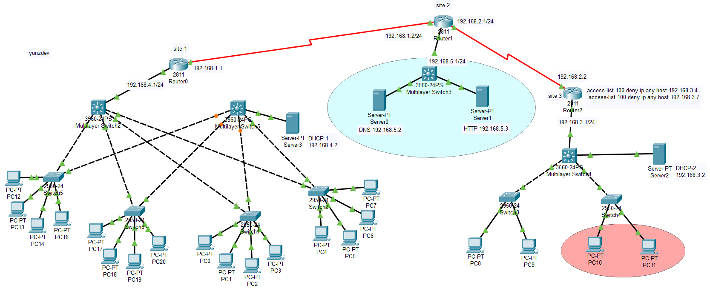

# Network Topology - Cisco Packet Tracer
 
A multi-site university network topology built in Cisco Packet Tracer, featuring interconnected LANs, a dedicated server/DMZ segment, Layer 3 switching, redundant LAN links, DHCP/DNS/HTTP services, and traffic filtering with extended ACLs.
 
The topology is divided into three sites connected through Cisco 2811 routers:
 


 
##  Network Architecture
 
The network uses a three-site routed architecture.
 
Each site has a dedicated router and Layer 3 switching infrastructure, while the inter-site connections use separate /24 point-to-point networks.
 
| Network | Purpose | Key Addresses |
|---|---|---|
| `192.168.1.0/24` | Site 1 ↔ Site 2 | Router0: `192.168.1.1` · Router1: `192.168.1.2` |
| `192.168.2.0/24` | Site 2 ↔ Site 3 | Router1: `192.168.2.1` · Router2: `192.168.2.2` |
| `192.168.3.0/24` | Site 3 LAN | Router2: `192.168.3.1` |
| `192.168.4.0/24` | Site 1 LAN | Router0: `192.168.4.1` |
| `192.168.5.0/24` | Site 2 Server/DMZ network | MultiLayer Switch3: `192.168.5.1` |
 
## Site 1 
 
- **Router0**: Cisco 2811
  - WAN: `192.168.1.1/24`
  - LAN: `192.168.4.1/24`
- **Multilayer Switch2**: Cisco 3560-24PS
- **Multilayer Switch5**: Cisco 3560-24PS
The multilayer switches provide the central switching infrastructure and connect to multiple Cisco 2960-24 access switches.
 
### Redundancy
 
Multiple links are present between the distribution and access layers, providing a more resilient switching topology.
 
```
                Router0
                   │
          ┌────────┴────────┐
          │                 │
       MLS2               MLS5
        │ ╲               ╱ │
        │  ╲             ╱  │
      SW2   SW7         SW5  SW6
        │     │           │    │
       PCs   PCs         PCs  PCs
```
 
This design provides redundant paths between parts of the LAN and can support Spanning Tree Protocol (STP) depending on the switch configuration.

Site 1 includes a dedicated DHCP server: **DHCP-1** — `192.168.4.2`
## Site 2: Server / DMZ Network
 
Site 2 provides the network's centralized server infrastructure.
 
**Router1**: Cisco 2811 connects the site to both Site 1 and Site 3.
 
The local server network is:
 
```
192.168.5.0/24
```
 
with a Cisco 3560 multilayer switch acting as the Layer 3 gateway: `192.168.5.1`
### Services
 
| Address | Service |
|---|---|
| `192.168.5.2` | DNS Server |
| `192.168.5.3` | HTTP Server |
 
This segment acts as a dedicated server/DMZ-style network, separated from the main user LANs and reachable through the routed infrastructure.
 
## Site 3: Research LAN
 
Site 3 uses a smaller LAN architecture connected through **Router2** (Cisco 2811).
 
```
Router2
192.168.3.1
     │
     ▼
Multilayer Switch4
     │
 ┌───┴───┐
 │       │
SW3     SW4
 │       │
PCs     PCs
```
 
**Network:** `192.168.3.0/24`
 
A dedicated DHCP server is also present:
 
- **DHCP-2** — `192.168.3.2`
The access layer consists of Cisco 2960 switches connected to the multilayer switching layer.
 
## Access Control: Extended ACL
 
Traffic filtering is implemented on Router2 using extended IPv4 ACL's, for example:
 
```
access-list 100 deny ip any host 192.168.3.4
access-list 100 deny ip any host 192.168.3.7
```
 
ACL 100 blocks IP traffic destined for: `192.168.3.4` `192.168.3.7`

> The exact interface and direction where ACL 100 is applied depends on the Router2 configuration.
 
## Routing Architecture
 
The three routers form the routed backbone of the topology:
### Inter-site links
 
| Connection | Network |
|---|---|
| Router0 ↔ Router1 | `192.168.1.0/24` |
| Router1 ↔ Router2 | `192.168.2.0/24` |
 
These Layer 3 links provide connectivity between the three network segments.
 
- Useful Cisco IOS commands for inspection include:
 
```
show ip interface brief
show ip route
show running-config
show access-lists
```
 
For connectivity testing:
 
```
ping <destination-ip>
traceroute <destination-ip>
```
